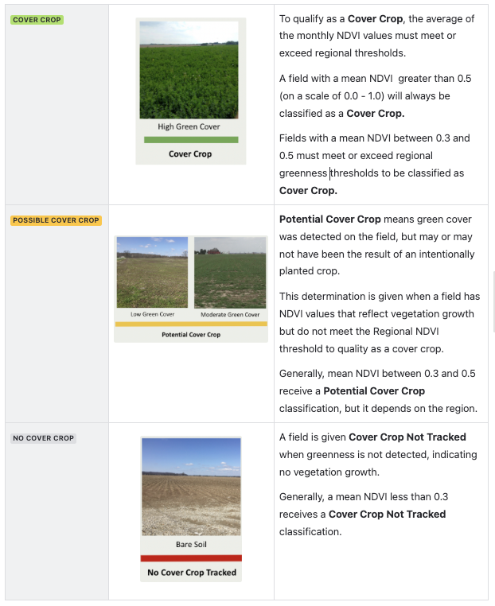

# Regrow Dataset

## What is the Regrow dataset?

Regrow is a proprietary dataset built from satellite remote sensing (Landsat 5–9 and Sentinel-1/2, with coverage dating back to 1985, though this project uses 2014–2025 land management data). Regrow's **Parcel ID** model delineates agricultural field boundaries directly from satellite imagery — a "Regrow field" is the output of that delineation algorithm, not a property/tax boundary. For each delineated field, Regrow's **MonitorML** practice-detection models report a timeline of land preparation, tillage intensity, cover crop presence, and main commodity crop, for each state in the study region, from 2014–2025.

## What is a "Regrow field"?

A Regrow field is a parcel-shaped output of Regrow's in-house field-delineation model (Parcel ID), constructed by analyzing satellite imagery to find areas with homogeneous cropping sequences. It is **not** the same kind of object as a "DISES parcel" (see [DISES Dataset](23-dises-dataset.md)), which is derived from tax/ownership records — the two can and do diverge, sometimes substantially, in shape and extent for the same physical land. Background on the delineation methodology: Regrow's [Introduction to Remote Sensing for Agriculture Monitoring](https://help.regrow.ag/introduction-to-remote-sensing-for-agriculture-monitoring) and [A Deep Dive into MonitorML](https://help.regrow.ag/a-deep-dive-into-monitorml).

## What is the geographic span of the Regrow data?

Regrow data is processed for 7 states: Illinois, Indiana, Iowa, Michigan, Minnesota, Ohio, Wisconsin. For Michigan specifically, coverage is limited to two counties adjacent to Ohio, rather than the full state.

## What land management practices are available in the Regrow dataset?

Four practice categories, organized around the concept of a **cultivation cycle** (see below):

- **Post-harvest tillage** — tillage intensity in the observation window following a harvest
- **Cover crop** — whether a cover crop was present between two commodity crops
- **Pre-plant tillage** — tillage intensity in the observation window preceding main crop planting
- **Main (commodity) crop** — which crop was grown, with planting/harvest dates

## How does Regrow detect and define tillage classes?

Regrow does not detect tillage *events* directly — it estimates **crop residue cover** using indices like the Normalized Difference Tillage Index (NDTI) and Crop Residue Cover Index (CRC), derived from satellite imagery, observed over two 8-week windows per cultivation cycle: one starting at harvest ("post-harvest") and one ending at planting ("pre-plant"). Tillage class is assigned from residue cover following USDA's standard residue-to-tillage-practice thresholds, which differ for fragile vs. non-fragile crops:

| | Fragile crops | Non-fragile crops |
| --- | --- | --- |
| No-till | >30% residue | >60% residue |
| Reduced till | 15–30% residue | 30–60% residue |
| Conventional till | 0–15% residue | 0–30% residue |
| Example crops | Soybean, cotton, wheat, canola, dry bean, sugar beet | Corn, alfalfa, sugarcane, sorghum, switchgrass |

Per Regrow's [Remote Sensing Practice Detection Technology](https://help.regrow.ag/remote-sensing-practice-detection-technology), the actual determination process is:

> "Weekly residue cover percentages are calculated over the two 8-week observation periods, pre-plant and post-harvest. Observations with the highest confidence (where the greatest area of the field was observed and where residue cover estimations within the field were consistent) are identified, and a tillage intensity classification is made based on the median residue percent of those observations. This provides two tillage intensity estimations for each crop cycle."

Additional information on how Regrow defines tillage practices and the peculiarities of tillage detection is available in Regrow's [Tillage Definitions Explained](https://help.regrow.ag/tillage-definitions-explained) guide.

## How does Regrow detect and define cover crop classes?

Regrow reports a cover crop **presence indicator**, not a cover crop *type* — fields are evaluated for sustained "green cover" during the window between one commodity crop's harvest and the next planting, requiring at least 8 weeks of observation (to exclude temporary regrowth, weeds, or volunteer plants). Greenness is measured via Normalized Difference Vegetation Index (NDVI), sampled roughly every 5–10 days and averaged monthly, then compared against a **regional NDVI threshold calculated annually** from surrounding natural herbaceous vegetation, to account for local and year-to-year variation in weather (winter conditions can push this threshold toward a seasonal minimum).

  
Source: [Remote Sensing Practice Detection Technology](https://help.regrow.ag/remote-sensing-practice-detection-technology)

There are five cover crop categories in Regrow data: three reflect sustained greenness, ordered from lowest to highest, and two reflect a different kind of situation (a data-availability gap, or a field where the observation doesn't apply at all) rather than a point on the greenness scale:

- **Cover crop not tracked** — average NDVI over the full observation window is low, comparable to having no green cover at all
- **Potential cover crop** — some sustained greenness detected, but not strong/consistent enough to confidently call a cover crop
- **Cover crop** — NDVI sustained above the regional/seasonal threshold throughout the observation window — confident detection of a cover crop
- **No green cover data** — there was not enough high-quality remote-sensing imagery available during the observation window to make a meaningful cover-crop determination (analogous to the "no tillage data" outcome for tillage — a data-availability gap, not a low-NDVI classification)
- **Cover crop not applicable** — the field is not expected to have a cover crop at all in a given year, because a perennial crop is grown on that field that year

One source of ambiguity worth noting: a field where a cover crop was intentionally seeded but failed to establish (e.g., winterkill, or non-sustained emergence) will also show low average NDVI over the observation period, so it can land in either the "Cover crop not tracked" or "Potential cover crop" class — the algorithm cannot distinguish "no cover crop was attempted" from "a cover crop was attempted but didn't survive," since both look like low, non-sustained greenness.

Additional information on cover crop detection: [Remote Sensing Practice Detection Technology](https://help.regrow.ag/remote-sensing-practice-detection-technology)

## How does Regrow detect and define commodity crops?

Regrow's **CropID** is a machine-learning model trained to detect and identify common crops in a field. It analyzes multi-spectral Sentinel-2 satellite data throughout the growing season to determine crop type, based on historical data and crop-specific spectral signatures (learned reflectance values for each crop). By learning these reflectance values, CropID can predict crop type just one to two months after harvest, and in some cases even during the growing season.

The model also uses satellite imagery and vegetation indices — NDVI and EVI, which measure the chlorophyll content in crops — together with region-specific crop calendars, which account for local farming practices, to identify crop emergence and senescence. The reported "planting date" is the **detected emergence date**, not a seeding date: the actual planting date may differ from the detected emergence, and harvest timing may vary depending on how much green vegetation remains.

Additional information on commodity crop detection: [Remote Sensing Practice Detection Technology](https://help.regrow.ag/remote-sensing-practice-detection-technology)

## Transformation of the Regrow commodity crop variable

`clean_regrow_table.py` recodes Regrow's string crop names (e.g. `"corn"`, `"soybean"`, `"wheat_winter"`) into integer codes via a hardcoded crosswalk (`main_crop_map`). This crosswalk is deliberately aligned with the **USDA CDL/CSB numeric crop code scheme** (e.g. corn=1, soybean=5, winter wheat=24) so that Regrow crop calls can be directly compared against CDL pixel values without further remapping, and so that Regrow and CSB main-crop codes are directly comparable to each other. One sentinel value, `999`, is used for `non_cropland`/`berry` — `999` is **not** a real CDL code; it's a pipeline-internal "doesn't map cleanly" marker.

Performing this transformation also serves a data-quality purpose beyond enabling CDL comparison: building the crosswalk requires explicitly enumerating every distinct crop-name string Regrow uses, which surfaces cases where the same underlying crop is recorded under two different raw names (e.g. `"flax"` and `"flaxseed"`, or `"evergreen"` and `"forest_evergreen"`) so they can be deliberately mapped to the same numeric code rather than being silently treated as different crops downstream.

## How are raw and processed Regrow datasets structured? What is a cultivation cycle?

Raw Regrow data arrives as a **long table, one row per cultivation cycle per field**. `clean_regrow_table.py` reorganizes this into the project's final format: a **wide table, one row per field**, with practice/crop values spread across columns indexed by calendar year and cultivation cycle number.

A **cultivation cycle** is the unit that raw Regrow data is built around: it groups the full sequence of land management activities — post-harvest tillage → cover crop → pre-plant tillage → main crop — that contribute to growing **one** commodity crop, following a **harvest-to-harvest model** (not a calendar-year model). A cycle starts the day after the previous crop's harvest and ends at the next commodity's harvest. Because a cultivation cycle is defined around a single commodity crop by construction, **a field cannot have more than one main crop within a single cultivation cycle** — that scenario is excluded by the definition of a cultivation cycle. What *can* happen is multiple complete cultivation cycles occurring within the same calendar year (e.g. two crops grown in succession in one growing season); the pipeline handles this by adding a cultivation-cycle-number suffix to the variable name, rather than by allowing multiple crops inside one cycle. Fallow periods are themselves reported as a "fallow" cultivation cycle, so the data structure stays uniform even when a field sits idle. Source: [Monitor Cultivation Cycles](https://help.regrow.ag/monitor-cultivation-cycles).

Reorganizing the raw long table into the final wide table involves three steps:

1. **Assign each cultivation cycle a calendar year.** The pipeline uses `end_year` — the calendar year in which that cycle's main crop was harvested — as the cycle's year label. `end_year` is used (rather than, say, the cycle's start date) because the harvest date is the one fixed, unambiguous point in a harvest-to-harvest cycle: a cycle's *start* is just whenever the *previous* crop happened to be harvested, which could fall in the prior calendar year, but its *end* is always the harvest of the crop the cycle is actually about.
2. **Number the cultivation cycles within each field-year.** Within a given field and `end_year`, cycles are numbered in chronological order as `cycle_count` (1st, 2nd, or 3rd cycle ending in that calendar year — capped at 3). This `cycle_count` is the mechanism that captures multiple cultivation cycles landing in the same calendar year, since (per above) it's never the case that one cycle itself contains more than one main crop.
3. **Pivot from long to wide table.** The long table is pivoted so that each `(activity, end_year, cycle_count)` combination becomes its own column, producing the variable-naming convention used throughout this project:

   ```text
   {land management activity}_{year}_{cultivation cycle number}
   ```

   where `land management activity ∈ {PHtill, cover, PPtill, crop}`, `year` is the 2-digit `end_year`, and `cultivation cycle number ∈ {1, 2, 3}`.

**Handling multiple records within the same cycle.** Although a cycle can only have one main crop, it can have more than one *recorded tillage event* of the same type (e.g. a field tilled twice within one cycle's post-harvest window). Before pivoting, such repeated records are aggregated using these rules: if the repeated records share identical dates and identical values, the value is kept as a single observation; if dates are identical but the recorded values differ, the result is set to missing (the conflicting records can't both be right); if the dates genuinely differ (i.e. these are two distinct tillage events, not duplicate records of the same event), the two values are joined into one **compound code** representing the pair — for example, a field tilled twice within one cycle, once no-till and once reduced-till, is recorded as a single combined tillage code (5) representing that specific pair, rather than as two separate tillage columns. The full set of these paired codes is in the table below.

Because more than one tillage *event* can occur within a single cycle, the tillage code is not a strict 1/2/3 ordinal scale — it also encodes same-or-mixed-intensity *pairs*:

| Code | Meaning |
| --- | --- |
| 1 | No-till (single event, or two no-till events) |
| 2 | Reduced till (single event, or no-till + reduced-till pair) |
| 3 | Conventional till (single event, or no-till + conventional-till pair) |
| 4 | Reduced-till + reduced-till pair |
| 5 | Reduced-till + conventional-till pair |
| 6 | Conventional-till + conventional-till pair |

**Cover crop codes**: `1` = no cover crop, `2` = potential cover crop, `3` = detected cover crop, `999` = cover crop not applicable.

## What is the Regrow confidence score?

Confidence quantifies how reliable a given practice classification is, and is affected by remote-sensing data availability/quality (cloud cover degrades it). For **main crop**, confidence is on a 0–100 scale and is explicitly probabilistic: "a confidence score of 80 means roughly 8 out of 10 times the model gets this crop type right" — Regrow recommends treating ≥75 as reliable. For **tillage** and **cover crop**, confidence is on a coarser 1–3 scale; Regrow recommends relying on observations with confidence = 3. Source: Monitor Data Explainer files, [Remote Sensing Practice Detection Technology](https://help.regrow.ag/remote-sensing-practice-detection-technology).

## How is confidence score determined for tillage, cover crop, and main crop?

- **Tillage**: confidence is rated 1–3 for each weekly residue observation in the 8-week window. A given week's confidence reflects how much of the field was actually observed (cloud cover reduces this) and how spatially consistent the residue-cover estimates were across the observed area (low variability across the field = higher confidence); confidence is also reduced when green crop canopy covers the soil, since residue is harder to detect underneath it. Per Regrow's documentation, the observations with the highest confidence in the 8-week window are identified, and the tillage classification is based on the median residue percent of those highest-confidence observations — producing two tillage estimations per cultivation cycle (one pre-plant, one post-harvest).
- **Cover crop**: confidence (0–3) is the average percent of the observation window actually observed via satellite (more cloud-free, high-quality observations → higher confidence).
- **Main crop**: confidence (0–100) reflects the statistical reliability of the crop-type call itself, from the CropID model.

## How does Regrow address uncertainty from remote sensing data and algorithm errors?

Cloud cover and sensor limitations are the primary sources of observational error; Regrow mitigates this by using multi-week observation windows rather than single snapshots and explicit confidence scoring at every level (tillage, cover crop, crop). It also creates **intermediate classes** for cases of genuine ambiguity rather than forcing a binary call — e.g. "potential cover crop" sits between "not tracked" and "cover crop detected" specifically to flag low-confidence green-cover signals.

## How is Regrow data validated?

Regrow's own validation (per their public documentation) compares crop-type predictions against ground-truth survey/government data using various quality metrics on a representative benchmark subset, with reported accuracy ranging ~70–95% depending on crop and region; tillage detection has been benchmarked at ~71% accuracy distinguishing conventional vs. conservation tillage over 22,000+ observations, and cover crop detection at ~85% accuracy over 25,000+ field observations (continental US).

**In addition, this project runs its own independent validation** of Regrow's main-crop calls against USDA's Cropland Data Layer (CDL), implemented in `rasterize_regrow_to_CDL_grid.py` → `join_regrow_cdl.py` → `validate_regrow_crop_with_cdl.py`:

1. Regrow field polygons are rasterized onto the exact CDL pixel grid (pixel-center rule), after dropping near-duplicate overlapping polygons and resolving the grid alignment across all CDL years.
2. For each state/year, the **modal** CDL crop class observed under each field's footprint is computed.
3. A field is flagged `cdl_valid_{year} = 1` if that modal CDL class matches *any* of the field's Regrow-reported main crop codes for that year (across all recorded cultivation cycles), else `0`.
4. `validate_regrow_crop_with_cdl.py` summarizes percent-valid fields by year and by crop category (all crops; corn only; soybean only; winter wheat only; corn+soy+all-wheat combined), saved as one Excel file per state.

## What are the key attributes of the Regrow dataset?

Regrow's key attributes are: field size (area), the land management practice variables themselves — tillage intensity, cover crop presence, and main crop — and the attributes associated with each of those land management values: their start/end dates and confidence scores. Alongside these are the field's unique identifier (`field_id`) and geographic location (geometry).

## What naming conventions are used for Regrow variables?

`{activity}_{year}_{cultivation cycle number}` for practice/crop values (e.g. `crop_23_1`), with `_start`, `_end`, `_conf` suffixes for the corresponding date/confidence companions of each (e.g. `crop_start_23_1`, `crop_conf_23_1`).

## Where can I find more information about Regrow dataset attributes?

`[TODO — paste links]`

- Raw Regrow Codebooks:
- Regrow_DISES_Supplementary_Data Codebook:
- Regrow Dataset Overview (slide deck):
