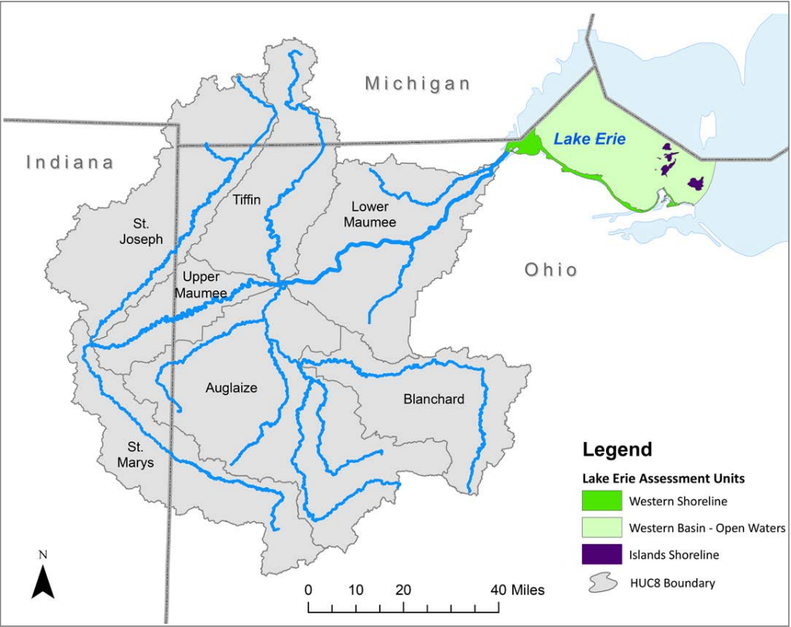

# Maumee Watershed Filtering

The Maumee River watershed is the largest in the Great Lakes region, consisting of **seven subbasins** that drain into the Western Basin of Lake Erie. To filter fields to the Maumee watershed, use the `subbasin_id` variable from the supplement 3 data file together with the HUC-8 codes for those subbasins.

 

**Table 1. HUC-8 codes for the Maumee subbasins**

| HUC-8 code | Watershed name |
|---|---|
| 04100003 | St. Joseph River |
| 04100004 | St. Marys River |
| 04100005 | Upper Maumee River |
| 04100006 | Tiffin River |
| 04100007 | Auglaize River |
| 04100008 | Blanchard River |
| 04100009 | Lower Maumee River |

*Source: Ohio EPA Technical Report AMS/2020-MWN-5.*

 

**Figure 1. Maumee River watershed subbasins and Lake Erie drainage area**

*Source: Ohio EPA Technical Report AMS/2020-MWN-5.*
